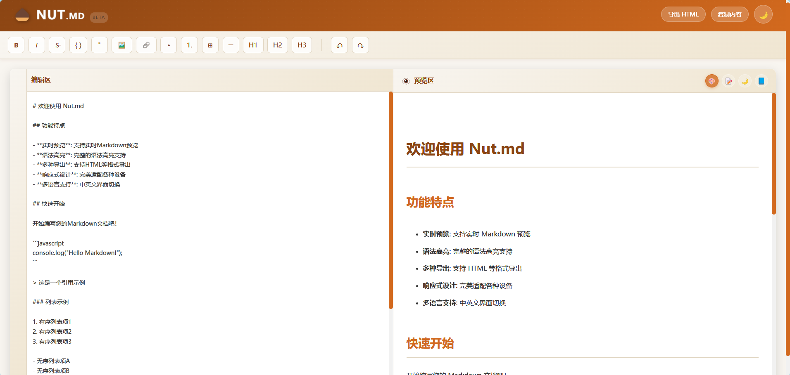

# 在线Markdown编辑器

一个基于Vue 3和Vite构建的现代化在线Markdown编辑器，支持实时预览、代码高亮、数学公式等功能。

## 🎯 功能特性



- ✅ 实时Markdown预览
- ✅ 代码语法高亮
- ✅ 数学公式支持（KaTeX）
- ✅ 响应式设计，适配不同设备
- ✅ 简洁美观的用户界面
- ✅ 支持导出功能

## 🛠 技术栈

- **前端框架**: Vue 3
- **构建工具**: Vite
- **Markdown解析**: marked
- **代码高亮**: highlight.js
- **数学公式**: KaTeX
- **样式预处理**: SCSS
- **安全处理**: DOMPurify

## 📦 安装和运行

### 前提条件

- Node.js 18.0或更高版本
- npm 9.0或更高版本

### 安装依赖

```bash
npm install
```

### 开发模式运行

```bash
npm run dev
```

应用将在 `http://localhost:5173` 启动。

### 构建生产版本

```bash
npm run build
```

构建产物将生成在 `dist` 目录中。

## 🚀 部署

### Cloudflare Pages

1. 连接你的GitHub仓库到Cloudflare Pages
2. 配置构建设置：
   - 构建命令: `npm run build`
   - 输出目录: `dist`
3. 保存配置并触发构建

### 其他静态网站托管服务

该项目是纯静态应用，可以部署到任何支持静态网站托管的服务，如：
- Vercel
- Netlify
- GitHub Pages
- AWS S3 + CloudFront

## 📁 项目结构

```
trae_demo/
├── dist/            # 构建输出目录
├── public/          # 静态资源
├── src/             # 源代码
│   ├── components/  # Vue组件
│   │   ├── Editor.vue     # Markdown编辑器组件
│   │   ├── Preview.vue    # 预览组件
│   │   └── Toolbar.vue    # 工具栏组件
│   ├── styles/      # 样式文件
│   │   └── main.scss      # 主样式文件
│   ├── App.vue      # 应用根组件
│   └── main.js      # 应用入口文件
├── .gitignore       # Git忽略文件
├── index.html       # HTML模板
├── package.json     # 项目配置和依赖
└── vite.config.js   # Vite配置
```

## 🎨 自定义

### 样式修改

修改 `src/styles/main.scss` 文件来自定义编辑器的外观。

### 功能扩展

可以通过修改 `src/components` 目录下的组件来扩展编辑器功能。

## 🔒 安全

项目使用 DOMPurify 来防止 XSS 攻击，确保用户输入的安全性。

## 📄 许可证

本项目采用 MIT 许可证。详见 [LICENSE](LICENSE) 文件。

## 🤝 贡献

欢迎提交 Issue 和 Pull Request 来改进这个项目！

## 📞 联系方式

如有问题或建议，请通过 GitHub Issues 与我们联系。

---

**享受你的Markdown编辑体验！** ✨